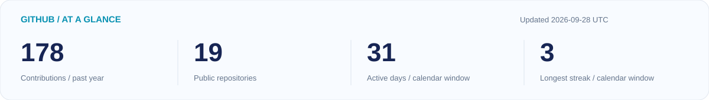
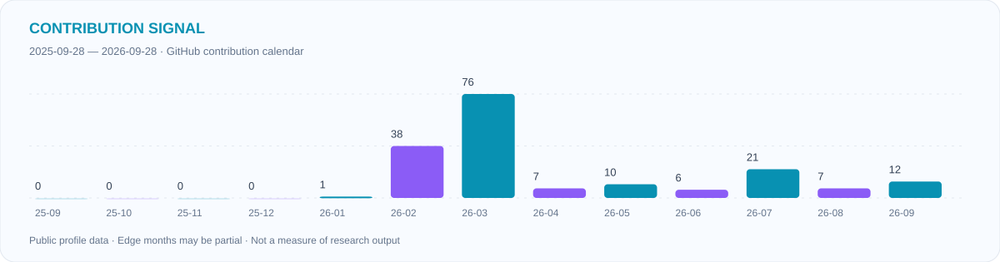

 

**程炜豪 · Undergraduate Researcher · Hangzhou, China**

[Research](#research) · [Publications](#publications) · [Open Source](#open-source) · [Academic Service](#academic-service) · [GitHub Activity](#github-activity)

## About

I am an undergraduate in the **School of Communication Engineering at Hangzhou Dianzi University** (2024–2028, expected), advised by **Huihui Ye, Haicheng Tu, and Feiwei Qin**. My research spans medical imaging, multimodal learning, and AI agents for healthcare.

- **Ant Group · Ant Afu Health Business Group** — Intern; LLM Agents / Agentic Reasoning · Agent Benchmarks.
- **JoVE · Guest Editor** — [AI in Medical Imaging Diagnostics: Reproducible Protocols from Data Curation to Clinical Validation](https://www.jove.com/cn/topical-collections/5797/artificial-intelligence-in-medical-imaging-diagnostics-reproducible-protocols-from-data-curation-to-clinical-validation).
- **MICCAI 2026 · Reviewer Honorable Mention** — received during my sophomore year.

## Research

<table>
<tr>
<td width="33%" valign="top"><h3>01 / Medical Imaging</h3>
MRI reconstruction, cardiovascular AI, medical image analysis, and multimodal medical data.
IMAGING → REPRESENTATION</td>
<td width="34%" valign="top"><h3>02 / Agentic Intelligence</h3>
Healthcare LLMs, collaborative agents, clinical reasoning, and agent benchmarks.
EVIDENCE → REASONING</td>
<td width="33%" valign="top"><h3>03 / Resilient Systems</h3>
Intelligent big data analytics, cyber–physical power systems, and optimization.
MODELING → DECISION</td>
</tr>
</table>

## Publications

Selected work from my [academic homepage](https://vhocheng.github.io/#publications). Publication types and submission status are listed separately.

### Journal & conference work

| Work | Venue / status | My role |
| :--- | :--- | :--- |
| [**PathLens**: A lightweight multimodal reasoner for in-depth pathology insights](https://doi.org/10.1016/j.knosys.2026.116261) | Knowledge-Based Systems · 2026 · Published | Co-author |
| [**VeloSubspace**: Phase-Aware Training-Free Reconstruction for Highly Accelerated 4D Flow MRI](https://vhocheng.github.io/#paper-velosubspace) | MICCAI Workshop · CMRx4DFlow Challenge · 2026 · Accepted | First author |
| [**MedCollab**: IBIS-Guided Multi-Agent Collaboration with Hierarchical Disease Relation Chains for Clinical Diagnosis](https://vhocheng.github.io/#paper-medcollab) | NLPCC · 2026 · Accepted | Co-author |
| [**CardioTwin**: A Physio-GPM-Driven Multimodal Foundation Model and Causally Interpretable Fusion Framework for Cardiac Digital Twins](https://vhocheng.github.io/#paper-cardiotwin) | BME2026 · Conference abstract · Accepted for oral presentation | First author |

### Submitted manuscripts

- **[Trustworthy Cardiac Digital Twins: An Intended-Use Assurance Framework for Multimodal Modeling and Clinical Translation](https://vhocheng.github.io/#paper-tbme)**  
  Weihao Cheng, Huihui Ye, and Huafeng Liu. Review manuscript submitted to **IEEE TBME**, 2026.
- **[Safe-Guarded Counterfactual Defense for Malware-Resilient Cyber–Physical Power Systems](https://vhocheng.github.io/#paper-tnse)**  
  Weihao Cheng, Haicheng Tu, Youjia Ling, Yongxiang Xia, and Xi Chen. Research manuscript submitted to **IEEE TNSE**, 2026.

Submitted manuscripts have not yet been accepted.

<b>Letters &amp; commentary · PNAS, Radiology, and clinical journals</b>

- **[Integrating Artificial Intelligence Into Endoscopy Education: Evidence, Gaps, and Future Directions](https://doi.org/10.1111/den.70114)**  
  Digestive Endoscopy · 2026 · Letter to the Editor · First & corresponding author.
- **[Advancing personalized risk assessment in post-TIPS hepatic encephalopathy: insights and future directions](https://doi.org/10.1007/s12072-026-11043-1)**  
  Hepatology International · 2026 · Letter to the Editor · First author.
- **[Artificial intelligence-assisted CCTA for coronary stenosis detection: Diagnostic promise, methodological nuances, and directions for clinical translation](https://doi.org/10.1016/j.ejrad.2026.112670)**  
  European Journal of Radiology · 2026 · Letter to the Editor · First & corresponding author.
- **[Domain-Specific LLMs in Radiology: Considerations for Cross-Site and Temporal Robustness](https://doi.org/10.1148/radiol.252758)**  
  Radiology · 2026 · Letter to the Editor · First author.
- **[Integrating generative AI and physical tests to strengthen claims about emergent phenomena](https://doi.org/10.1073/pnas.2529610122)**  
  PNAS · 2025 · Letter to the Editor · First author.

## Open Source

<table>
<tr>
<td width="50%" valign="top"><h3><a href="https://github.com/hovchen/PathLens">PathLens ↗</a></h3>
A lightweight multimodal reasoner for in-depth pathology insights.
MULTIMODAL REASONING · PATHOLOGY</td>
<td width="50%" valign="top"><h3><a href="https://github.com/VhoCheng/IschemoAgents">IschemoAgents ↗</a></h3>
Mechanism-constrained multi-agent ECG–imaging intelligence for early myocardial ischemia.
ECG + IMAGING · COLLABORATIVE AGENTS</td>
</tr>
<tr>
<td valign="top"><h3><a href="https://github.com/VhoCheng/MedScope">MedScope ↗</a></h3>
A lightweight benchmark for evaluating open-source LLMs on medical question answering.
MEDICAL QA · EVALUATION</td>
<td valign="top"><h3><a href="https://github.com/VhoCheng/DentVision">DentVision ↗</a></h3>
Deep learning for dental cavity detection in intraoral images.
COMPUTER VISION · DENTAL IMAGING</td>
</tr>
<tr>
<td valign="top"><h3><a href="https://github.com/VhoCheng/AIAgent-References">AIAgent-References ↗</a></h3>
Research, projects, and resources on agentic AI in healthcare.
OPEN KNOWLEDGE · HEALTHCARE AGENTS</td>
<td valign="top"><h3><a href="https://github.com/HovChen/Paper-List-for-Medical-Reasoning-Large-Language-Models">Medical Reasoning LLMs ↗</a></h3>
A curated reading list on medical reasoning with large language models.
READING LIST · MEDICAL REASONING</td>
</tr>
</table>

## Academic Service

| Role | Community |
| :--- | :--- |
| **Guest Editor** | [JoVE topical collection on AI in medical imaging diagnostics](https://www.jove.com/cn/topical-collections/5797/artificial-intelligence-in-medical-imaging-diagnostics-reproducible-protocols-from-data-curation-to-clinical-validation) · [Editor profile](https://www.jove.com/cn/topical-collections/editor/8992/weihao-cheng) |
| **Conference Reviewer** | ICLR 2027 · MICCAI 2026 (Honorable Mention) · NLPCC 2026 · CTESP 2026 · IEEE ICHI 2026 |
| **Journal Reviewer** | World Journal of Gastrointestinal Surgery · World Journal of Psychiatry · World Journal of Gastroenterology |
| **Student Member** | CCF · CIC · CMES · CAAI · CSIG · CSBME |

<b>Selected honors, credentials &amp; experience</b>

- **National Second Prize · Team Leader**, China Undergraduate Mechanical Engineering Innovation & Creativity Competition, Intelligent Manufacturing Competition, 2026.
- **“Qiuxin Star”**, Youth Hangdian Top 100 Outstanding Students; the only sophomore recipient in the School.
- **Project Leader**, National Undergraduate Innovation and Entrepreneurship Training Program, 2026.
- **Large Language Model Development Engineer**, Datawhale / Inspur Information.
- **HarmonyOS Application Developer — Foundation Certification**, Huawei Developers.
- **Artificial Intelligence Trainer — Junior & Advanced**, Alibaba DAMO Academy / Alibaba Cloud training and assessment.
- **Zhejiang Provincial Computer Rank Examination** — Level 2 (Python Programming); Level 3 (Computer Network Technology and Applications).
- Campus outreach with **NetEase Games, Xiaohongshu, Tonghuashun, and GoodWe**; internship/training experience with **Chaoxing Xuexitong and Gaotu**.

[Full experience & credentials →](https://vhocheng.github.io/#experience)

## Tools & Frameworks

  

## GitHub Activity

 

Contribution streak

 

### Contribution Snake

<picture>
  <source media="(prefers-color-scheme: dark)" srcset="https://raw.githubusercontent.com/VhoCheng/VhoCheng/output/github-contribution-grid-snake-dark.svg" />
  <source media="(prefers-color-scheme: light)" srcset="https://raw.githubusercontent.com/VhoCheng/VhoCheng/output/github-contribution-grid-snake.svg" />
  
</picture>

A year of contributions, one square at a time.

### Visitors & Connections

View counters are supplied by separate services and may differ.

  

**Let’s connect around medical AI, MRI, and research ideas.**  
[weihao_cheng@hdu.edu.cn](mailto:weihao_cheng@hdu.edu.cn) · [Academic homepage](https://vhocheng.github.io/)

 

